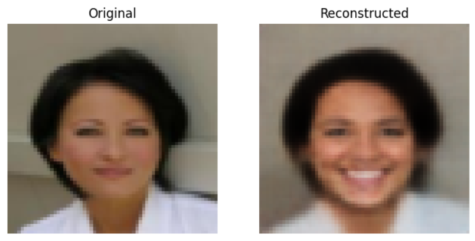
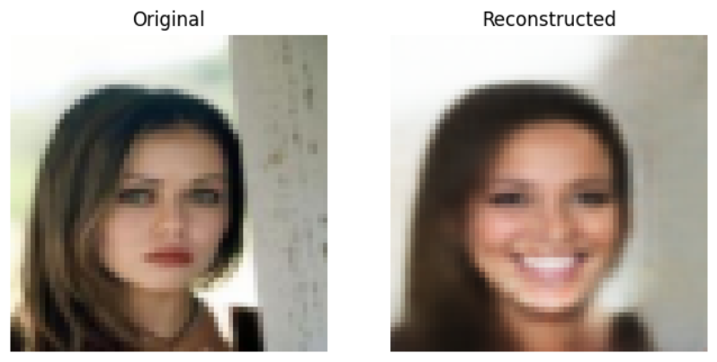
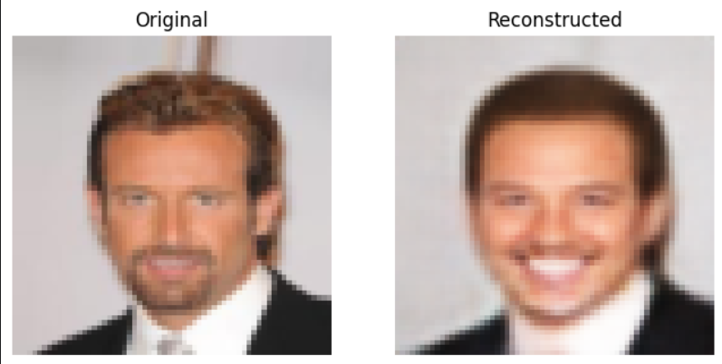
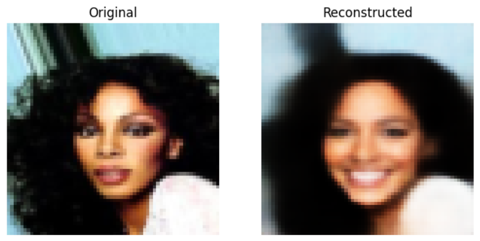

#  Variational AutoEncoder (VAE) - Training process & Facial Attribute Manipulation 
This repository includes **VAE implementation** & **CelebA Latent Manipulator** 
---

## Model
- **Variational AutoEncoder**: Includes `Encoder` and `Decoder` both parts are constructed with `Conv2d` (Encoder) and `ConvTranspose2d` (Decoder) Layers. I Decided to use `sigmoid` activation at the end of the `Decoder`

---
## Dataset:
- **CelebA** - dataset was selected due to its rich annotation of facial attributes (e.g., smiling, wearing glasses), which is crucial for experiments involving the manipulation and extraction of these features within the VAE's latent space [CelebA Dataset](https://www.kaggle.com/datasets/jessicali9530/celeba-dataset)
---

##  Results and Visualizations

* **Goal:** To be able to add smile to any neutral face.

### Results
* **Original Photos + Reconstructed versions with smile** 
  
  
  
  

## Training Details
All training details you can find in `vae_training.ipynb` notebook including training process, hyperparemeters etc. Training loop is available in `training.py`

## CelebA Latent Manipulator
Utility functions to perform latent manipulator are in `features.py` file. Also you can check `smile_generator.ipynb` notebook to look at details of dataset splitting, `smile_vector` computation etc.

## Space for improvement & experiments
- Training VAE longer (and try higher learning rate), because both training and test loss were constantly decreasing during 250 epochs
- Training on smaller part of **CelebA** (for example only for males/females)
- Trying out new features generator like adding glasses, beard etc.
